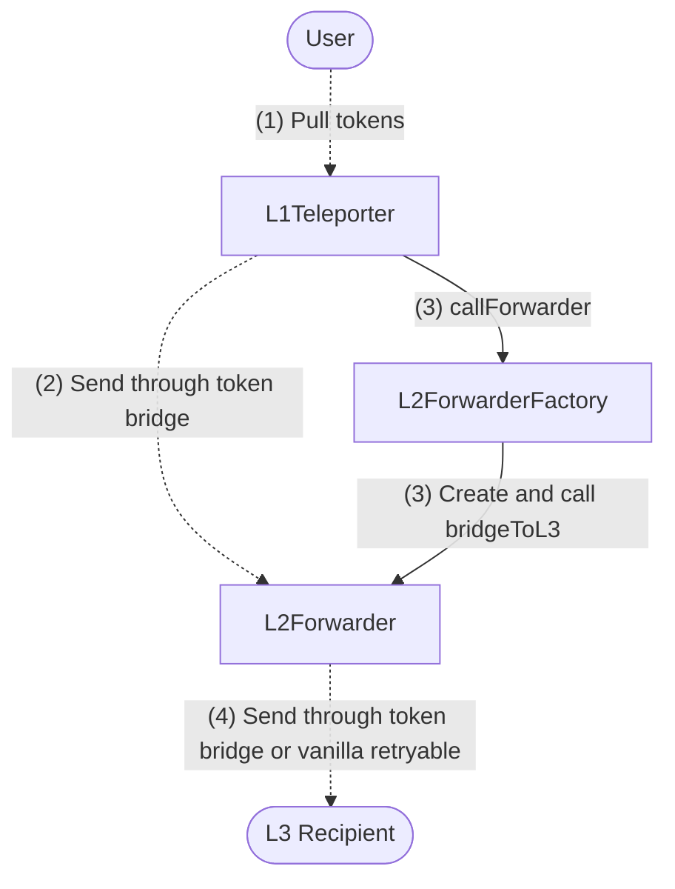

## Contracts Overview

- `L1Teleporter`
    - Deployed to Ethereum L1
    - Users call `teleport()` to initiate "teleportations"
    - Takes tokens from the user and sends them through an L2’s token bridge to a specific `L2Forwarder` whose address is predicted by CREATE2 logic
    - Creates a retryable to create and call the `L2Forwarder` via the `L2ForwarderFactory`
    - Can be paused by an owner(s)
- `L2ForwarderFactory`
    - Deployed to any Arbitrum L2 at the same address
    - Creates, initializes and calls `L2Forwarder` clones
- `L2Forwarder`
    - Implementation deployed to all Arbitrum L2’s at the same address
    - Factory-deployed clones receive funds from L1 and forward them to L3

## Deployment Procedure
Deploy `L1Teleporter`  on any L1, passing in predicted `L2Forwarder`  and `L2ForwarderFactory`  arguments. Deploy `L2ForwarderContractsDeployer` using a generic CREATE2 factory to the same address on any Arbitrum L2’s.

See `deploy.sh`  for detailed deployment flow.

## Detailed Teleportation Flow

1. User approves `L1Teleporter` to spend token and calls `L1Teleporter.teleport`:
    1. If the L3 uses a custom fee token, user approves the fee token as well
    2. Computes the `L2Forwarder` address
    3. Sends tokens through the L2’s token bridge to the predicted `L2Forwarder`
        1. If using a custom fee token, sends those through to the forwarder as well
    4. Creates a retryable to call `L2ForwarderFactory.callForwarder`
        1. Any ETH required to pay for the retryable to L3 is sent along through `l2CallValue` 
2. Token bridge retryable(s) redeemed. Tokens land at the `L2Forwarder` address.
3. `L2ForwarderFactory.callForwarder` retryable redeemed: 
    1. Create and initialize the user's `L2Forwarder` via `Clone` and CREATE2 if it does not already exist
    2. Call `L2Forwarder.bridgeToL3(...)` 
        1. If bridging an L3’s fee token:
            1. Call the L3’s inbox to create a retryable sending entire token balance less fees to the intended recipient
            2. ETH fee refunds from L1 to L2 retryables are kept by the forwarder
        2. If bridging a non fee token to a custom fee L3:
            1. Send user specified fee token amount to the inbox
            2. Send entire token balance through the token bridge to the recipient
            3. ETH fee refunds from L1 to L2 retryables are kept by the forwarder
        3. If bridging to an ETH fee L3:
            1. Send entire token balance through the token bridge to the recipient
            2. `maxSubmissionCost` equals the forwarder’s entire ETH balance minus L3 execution fee. This ensures entire ETH balance makes it to the recipient on L3.

## Retryable Failures and Out of Order Redemption

The token bridge retryables to L2 and L3 should always succeed (if auto redeem fails, manual redeem should succeed).

The second step can fail for a number of reasons, mostly due to bad parameters:
* Not enough ETH is sent to cover L2 -> L3 retryable submission cost + relayer payment
* Incorrect `l2l3Router`, `token`, etc

If for some reason the second step cannot succeed, TOKEN and ETH or FEETOKEN will be stuck at the `L2Forwarder`. As long as the `owner` parameter of the forwarder is correct, the `owner` can call `rescue` on the forwarder to recover funds.

It is possible that two L1 -> L3 transfers use the same `L2Forwarder` if they have the same `L2ForwarderParams`. Because of this, it is also possible that the second and third step of one of the transfers are not executed. It's okay if there are two simultaneous transfers A and B, where steps A1-B1-A2-A3 are executed since TOKEN from both A1 and B1 are transferred during A2.